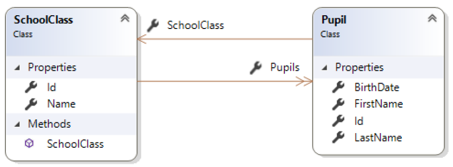
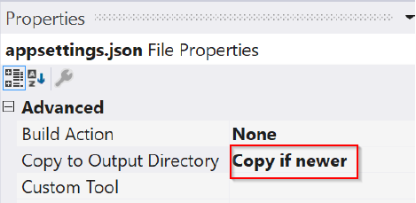
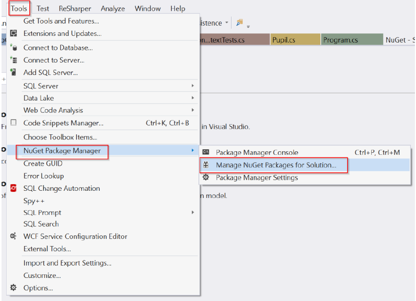
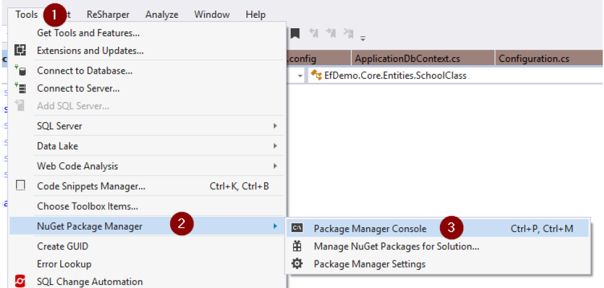
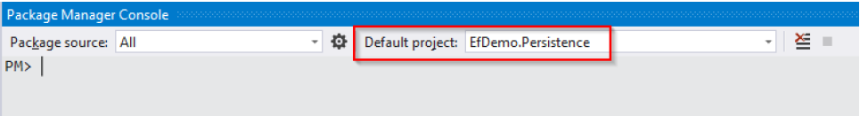
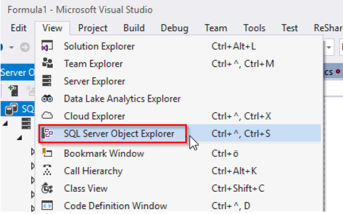
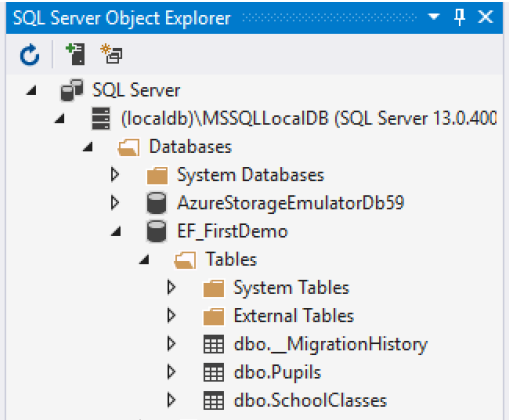
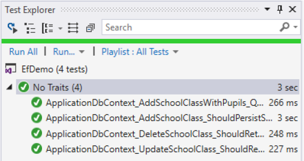

# EntityFramework FirstDemo

## Lernziele

* Entity Framework
* Linq
* Nuget Paketverwaltung

## Allgemein

Ziel dieser Übung ist die Grundlagen des Datenbankzugriffs per Entity Framework kennen zu lernen.

## Klassendiagramm



Die Typen `SchoolClass` und `Pupil` werden jeweils über eine `Id`-Eigenschaft identifiziert.
Ein `Pupil` besitzt eine Referenz auf seine `School Class`. Ebenso besitzt eine `SchoolClass` eine Sammlung von `Pupil`-Objekten.

## Aufgabenstellung

1. Definieren Sie das Projekt `EfDemo.Persistence` als Startup Project (Solution Explorer: rechte Maustaste auf das Projekt ->"Set As Startup Project").
1. Fügen Sie in folgenden Projekten die Datei `appsettings.json` hinzu:
   * EfDemo.Persistence
   * EfDemo.UI
1. Konfigurieren Sie in den Properties (View -> Property Page) für die Datei `appsettings.json` folgende Einstellung:
   
   

   Hinweis: Dies muss für beide Vorkommen dieser Datei durchgeführt werden! Dadurch wird die Konfigurationsdatei bei der Ausführung gefunden.

1. Fügen Sie folgende Konfiguration (Verbindungseinstellungen) in die Dateien `appsettings.json` ein: 
   ```json
   { 
      "ConnectionStrings": 
      { 
        "DefaultConnection": "Data Source=(localdb)\\MSSQLLocalDB;Initial Catalog=EFDemo;Integrated Security=True;" 
      }
   }
   ```
  
  1. Öffnen Sie den NuGet-Manager für die Solution:
   
     

  1. Fügen Sie folgende NuGet-Pakete hinzu:

        | Paket                                   | Core | Persistence | Test | UI |
        |:----------------------------------------|:----:|:-----------:|:----:|:--:|
        | Microsoft.EntityFrameworkCore           |  -   |     Ja      |  Ja  | Ja |
        | Microsoft.EntityFrameworkCore.Tools     |  -   |     Ja      |  -   | -  |
        | Microsoft.EntityFrameworkCore.SqlServer |  -   |     Ja      |  -   | Ja |
        | Microsoft.EntityFrameworkCore.InMemory  |  -   |      -      |  Ja  | -  |
        | Microsoft.Extensions.Configuration.Json |  -   |     Ja      |  -   | Ja |

  1. Kompilieren Sie die Solution.
  1. Öffnen Sie die „Package Manager Console“:

      

  1. Wählen Sie als "Default Project" das Projekt `EfDemo.Persistence` aus:

      

  1. Analysieren Sie die Klassen `Pupil` und `SchoolClass`.
  1. Führen Sie der der "Package Manager Console" folgendes Kommando aus: 

     ```
     Add-Migration InitialMigration
     ```

  1.  Analysieren Sie die neue Datei `Migrations\<FortlaufendeNr>_InitialMigration.cs`. Was fällt ihnen im Vergleich zu den Klassen `Pupil` und `SchoolClass` auf?
   
  1.  Wenn Sie die Migration auf die Datenbank an ("Package Manager Console"): 

      ```
      Update-Database -Verbose
      ```
 
  1.  Öffnen Sie den "SQL Server Object Explorer":

      

  1. Analysieren Sie die erstellten Tabellen – schauen Sie sich insbesondere die Struktur der Tabellen an. Betrachten Sie im Vergleich auch die (Navigations-)Properties dieser Klassen:

      

  1. Führen Sie mit dem "Test Explorer" die hinterlegten Unit Tests aus:

      

  1. Analysieren Sie die bestehenden Tests
  1. Erstellen Sie mithilfe eigener Unit Tests weitere Datenbankoperationen.
  1. Definieren Sie das Projekt `EfDemo.UI` als Startup Project (Solution Explorer: rechte Maustaste auf das Projekt ->"Set As Startup Project").
  1. Führen Sie das UI-Projekt aus und analysieren Sie die Ausgaben und den Quellcode.